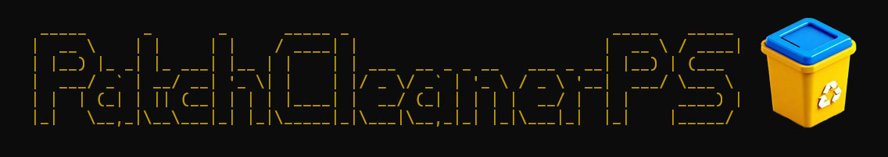

# PatchCleanerPS
The spiritual successor to John Crawford's PatchCleaner at homedev.com.au, but written completely in powershell.


---

## ✨ $\textcolor{yellow}{\text{Features}}$

- Identifies **orphaned `.MSI` and `.MSP` files**
- Supports **interactive** and **automatic** modes
- Optional **dry-run** functionality to preview changes
- **Vendor exclusion list** support
- **Cleans up empty folders** in `C:\Windows\Installer`

---

## 🧰 $\textcolor{yellow}{\text{Requirements}}$

- Windows 10 or later
- PowerShell 5.1 or PowerShell Core
- Administrator privileges

---

## 🚀 $\textcolor{yellow}{\text{Getting Started}}$

### 🔹 $\textcolor{cyan}{\text{Download}}$

Download a release on the right, or download the script from this repository.

```powershell
Invoke-WebRequest -Uri "https://github.com/jackharvest/PatchCleanerPS/raw/main/patchcleanerscript.ps1" -OutFile "PatchCleanerPS.ps1"
```

## $\textcolor{yellow}{\text{Running It}}$
### $\textcolor{cyan}{\text{Interactive Mode}}$
.\PatchCleanerPS.ps1

## $\textcolor{yellow}{\text{Automatic mode (skips prompts)}}$
.\PatchCleanerPS.ps1 -Auto

## Supported Parameters
| Parameter         | Description                                                      |
| ----------------- | ---------------------------------------------------------------- |
| `-Auto`           | Automatically delete orphaned files (prompts for each one)       |
| `-AutoAll`        | Automatically delete **all** orphaned files without prompting    |
| `-AutoDry`        | Perform a dry-run (preview deletions), with confirmation prompts |
| `-AutoDryAll`     | Perform a dry-run (preview deletions), no prompts                |
| `-ExcludeVendors` | Exclude files from specified vendors (e.g. Microsoft, Adobe)     |

## $\textcolor{yellow}{\text{Example}}$
### Preview what would be deleted, no prompts, excluding Microsoft and Adobe installers
.\PatchCleanerPS.ps1 -AutoDryAll -ExcludeVendors 'Microsoft','Adobe'
or
PatchCleanerPS.exe -AutoDryAll -ExcludeVendors 'Microsoft','Adobe'

## $\textcolor{yellow}{\text{Safety First}}$
-Files are cross-referenced against installed applications and patches

-Move move supports just moving the files instead of deletion

-Dry-run mode is available to preview what would be affected without making changes

-You can exclude vendor-related files with -ExcludeVendors for added safety

## $\textcolor{yellow}{\text{What it does}}$
-Scans C:\Windows\Installer for .msi and .msp files

-Cross-checks each file against installed applications and updates in the system registry

-Flags unreferenced/orphaned files for deletion

-Optionally deletes empty subfolders afterward for a clean finish

## $\textcolor{yellow}{\text{Deployment Options}}$
-Compiled .exe builds are available in the Releases section:

-Great for deploying via SCCM, Intune, PDQ Deploy, or other RMM tools

-Mirrors the same logic as the .ps1 script

-Supports silent parameters for automated workflows

## $\textcolor{yellow}{\text{Credits}}$
Inspired by the retired PatchCleaner by John Crawford (homedev.com.au)
Rewritten entirely from scratch in PowerShell by jackharvest

## $\textcolor{yellow}{\text{Contributions}}$
-Pull requests are welcome!

If you have:

-Feature suggestions

-Bug reports

-Enterprise integration tips (SCCM/Intune/etc)

-Please open an issue or PR. Just make sure you test changes responsibly — deleting system installers is serious business!

## $\textcolor{yellow}{\text{License}}$

This project is licensed under the MIT License.
See the LICENSE file for details.

## $\textcolor{yellow}{\text{Changelog}}$
Changes can be found in the releases section on the right.
